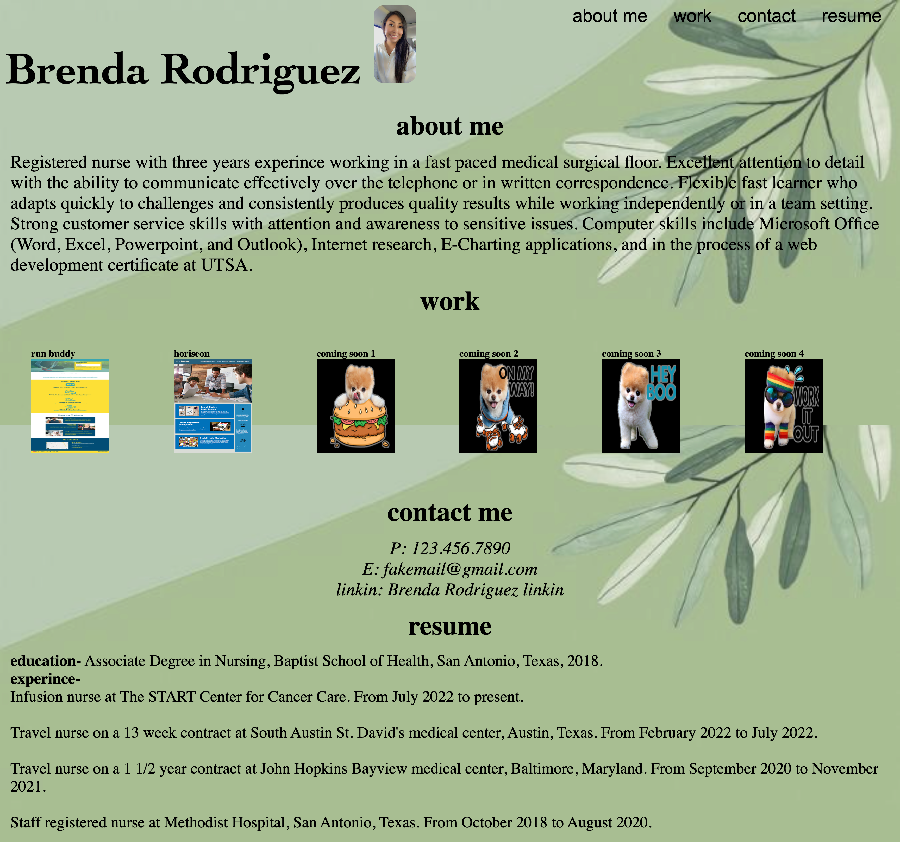

# Brenda's Portfolio

## Title

Challenge 2- creating your own portfolio

## Project Description

*This challenges includes creating your own code from scratch to build my own portfolio. For future employers to look at my work. 
*I've created a html index file, css stylesheet, readme file, organized css selector boxes to be modify for different screen sizes. Included links that deployed to 2 appplications that are my actual work that i have completed in the course. The other 4 are placeholders that are linked to random youtube videos. By the end of this course i shall add on to the 4 applicatiions and upgrade the design with each one. 

## URL link for live website

https://brenbrenda55.github.io/brendas-portfolio/

## Screenshot of Product

